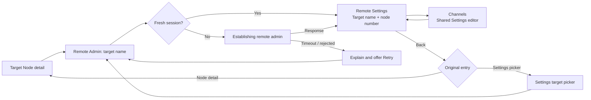

# Remote Administration

**Status:** Proposed — draft for maintainer review
**Audience:** Client, firmware, and protocol contributors
**Scope:** Native and web clients that administer a node over the mesh

## Purpose

Remote Administration lets an operator inspect and change the configuration of a reachable node without physically connecting to it. It must feel like administering one clearly identified device, rather than like changing a global application setting.

The workflow must work for a first-time operator who needs a clear path and explanation, while preserving the speed, target awareness, and recovery tools that experienced operators need in the field.

## Goals

- Make remote administration discoverable from the node being administered.
- Keep the target node visible and unambiguous for the entire workflow.
- Establish authorization before opening editable settings, and explain progress or failure in plain language.
- Reuse the same configuration and channel editors used for a directly connected node wherever the protocol semantics are the same.
- Make disruptive operations deliberate, attributable, and recoverable where the protocol permits.
- Preserve a predictable navigation path back to the originating node.

## Non-goals

- Change firmware authorization policy, cryptography, routing, or packet delivery guarantees.
- Promise that an action has been applied before the relevant response or acknowledgement has arrived.
- Expose settings or actions the target does not support.
- Replace local administration. A directly connected node remains the appropriate route for firmware flashing, physical recovery, and operations that cannot be safely performed over the mesh.

## Terminology

| Term | Meaning |
| --- | --- |
| **Local node** | The radio currently connected to the client. |
| **Target node** | The node selected for remote administration. |
| **Remote session** | The currently valid authorization material for one target on the current local-radio connection. It is transport state, not a user-visible device setting. |
| **Remote Settings** | The settings hub for one target node. |
| **Operation** | A non-configuration command, such as refreshing metadata, setting time, restarting, shutting down, or resetting a node. |

## Eligibility and entry

### Availability

The client may offer Remote Administration only when all of the following are true:

1. A local radio is connected.
2. The selected target is known to the client and is not the local node.
3. The target is eligible for an authorization path supported by the local radio and target firmware.

Eligibility is not proof that the operation will succeed. A node may be unreachable, have no valid authorization, or reject a request after it has been shown as eligible.

If eligibility cannot be determined yet, the entry remains unavailable with an explanation such as “Waiting for node information,” rather than presenting a control that silently fails.

Firmware supports both legacy admin-channel authorization and public-key authorization. The client presents one Remote Admin workflow regardless of the transport path; it does not ask a new operator to choose cryptographic modes. When a path is known to be unavailable, the explanation must say whether the node is unreachable, authorization is unavailable, or node information is still being retrieved.

For an authorization failure, provide a plain-language recovery destination such as “Learn how to authorize a remote administrator” or “Ask this node’s owner for access.” Do not reveal, copy, or collect keys, passphrases, or session material in the recovery flow.

### Primary entry point

The Node Detail screen is the primary entry point. Its Administration section contains one target-specific action:

> **Remote Admin: _{node name}_**

The action uses the selected node's long name, or its short name / node number when a long name is unavailable. It must not say merely “Remote Admin,” because operators commonly manage several nodes with similar roles.

The Settings area may retain a target picker for users who already work there, but it is a secondary entry point. Both entries invoke the same session and target-scoping behavior. When Remote Settings was opened from that picker, Back returns to the picker; when it was opened from Node Detail, Back returns to that node.

## Session and navigation behavior

### Flow overview



### Session state machine

The client treats a remote session as scoped to **both** the target node and the current local-radio connection.

| State | User-facing treatment | Required behavior |
| --- | --- | --- |
| Ready | `Remote Admin: {node name}` | Reuse a valid session and open Remote Settings. |
| Establishing | `Establishing remote admin for {node name}` with progress indicator | Disable duplicate activation and request the session data needed by the protocol. |
| Succeeded | Navigate to Remote Settings for that target | Bind the resulting settings route to the target node. |
| Timed out | “{node name} did not respond. Try again when it is reachable.” with Retry | Do not navigate. A late response may make the next attempt ready. |
| Disconnected | “Connect to a radio to administer {node name}.” | Cancel the attempt and do not navigate. |
| Rejected or invalid | Explain that authorization was denied or expired, then offer Retry if a fresh request is meaningful. | Do not imply that the user can edit the target. |

A client must subscribe for the expected session result before sending the request, so an immediately returned response is not lost. It must deduplicate repeated activation for the same target. The user-facing timeout is 30 seconds; it is a user-experience deadline, not evidence that the radio stopped trying. Late valid data may update the target's readiness but must never trigger unsolicited navigation.

Changing the target, disconnecting the local radio, or replacing the local-radio connection invalidates an in-flight attempt and any session bound to the prior connection. Results from the old attempt must not open settings for the new target or connection.

Firmware session passkeys are valid for at most 300 seconds from issuance and may be refreshed after 150 seconds when a response is issued. A client may mark a locally observed passkey stale after a conservative interval such as 240 seconds to reduce avoidable failures, but receipt time does not prove the key’s issuance time. The client must still handle a bad-session response by discarding the key and requiring a fresh session before another user-initiated write. Clear all remote sessions when the transport is torn down.

### Navigation contract

When entered from Node Detail, the required back path is:

```text
Nodes → Target Node → Remote Settings → Settings section → Editor
                                      ←                 ←
```

Back from an editor returns to its settings section. Back from a section returns to Remote Settings. Back from Remote Settings returns to the original entry context: the same target node for Node Detail entry, or the target picker for Settings entry. A client must not lose the target or return to a different node.

The Remote Settings title and its persistent target summary identify the target by name and node number. The summary remains visible while scrolling or is available from the navigation title/accessibility label. It must not rely only on a color, icon, or prior screen context.

## Remote Settings

### Loading and unavailable data

Remote Settings initially shows only configuration groups that the target supports and that are currently enabled. Each group may load independently. While data is being requested, show a non-blocking row-level loading state. If the target returns no data for a group, show an actionable explanation in that group, for example:

> “No response from {node name}. Try again when the node is reachable.”

Do not render empty editors, stale values from another target, or a generic `N/A` placeholder. Cached values may be shown only when labelled as previously received and still associated with this target.

For a supported but disabled module, hide its inactive configuration fields and retain the enable control in the appropriate parent configuration. That control explains that enabling the feature reveals its additional settings. This preserves conditional visibility without making a supported feature undiscoverable.

### Configuration editors

Use the same field names, validation, descriptions, defaults, and save behavior as the local-node editor for the corresponding configuration. Remote mode changes the transport and target context; it does not create a second configuration vocabulary.

Before sending a change, the editor identifies the target. While a change is pending, it prevents duplicate submits for that value and reports progress accessibly. On a response or acknowledgement, it refreshes the displayed target state. On failure, it retains the user’s unsent edit when safe, explains what failed, and offers Retry without applying the edit locally.

When changing a related group of settings, clients use the protocol’s begin-edit/commit-edit transaction where the target supports it. The UI shows that the group is being saved as one operation; it does not present each locally staged field as confirmed until the transaction completes. This is deferred persistence and reboot coordination, not a promise of atomic rollback. If the client loses the final result, it marks the save unconfirmed and refreshes the target before presenting further edits.

### Channels

Remote channels use the exact channel list and channel editor used by regular Settings. This keeps channel ordering, role rules, validation, key handling, and save behavior consistent for every administration path.

The remote context adds only target identity and transport feedback. It must not create a simplified channel editor or silently modify the local node's channels. The channels list and editor remain inside the Remote Settings navigation path. The editor enforces protocol rules, including valid channel indexes and the single-primary-channel invariant, and displays any device warnings returned after a channel save.

## Operations

Operations are separated from configuration because their effects may interrupt communication or destroy state. They use clear verbs and never hide destructive actions behind icon-only controls.

| Operation | Before dispatch | After dispatch |
| --- | --- | --- |
| Refresh device metadata | No destructive confirmation | Refresh the target summary and session readiness when a response arrives. |
| Set time | Confirm target and value when the value is not automatic | Show pending, succeeded, or failed state. |
| Restart / shut down | Confirmation names the target and states that it may go offline | Explain that loss of contact is expected; do not report success solely because the command was queued. |
| Reset configuration, factory reset, or NodeDB reset | Destructive confirmation names the target, describes the irreversible effect, and requires an explicit final action | Show that the command was sent. Report **acknowledged** only on an administrative response and **verified** only after refreshed target state confirms the effect; otherwise report **unconfirmed**. A connected local radio or loss of target contact does not itself confirm the reset. Do not offer automatic retry. |

Destructive confirmations must use the target’s name and node number. For factory reset or other irreversible actions, clients should require a stronger confirmation pattern appropriate to their platform, such as a destructive confirmation button plus a typed target name. A confirmation does not bypass firmware authorization.

## Feedback, accessibility, and terminology

- Every progress, warning, error, and success state includes both an icon and text.
- All controls meet platform touch-target and dynamic-type requirements; long node names wrap or truncate with an accessible full label.
- Errors name the target and next useful action. Avoid protocol-only language such as “bad session key” in primary copy; detailed diagnostic codes may appear in a copyable troubleshooting view.
- Visual state is never communicated by color alone.
- A screen reader announces the target when Remote Settings opens and announces progress/completion for a remote request.
- Clients use the terms **Remote Admin**, **Remote Settings**, **target node**, and **local node** consistently. Firmware/protocol identifiers remain implementation details unless needed for diagnostics.

## Data and protocol constraints

The protocol’s admin message contains a session passkey to prevent replay of administrative commands. Clients must treat that value as secret transport state: do not display it, log it, include it in crash reports, or persist it beyond the validity model required for the active connection.

Remote configuration reads and writes, channel reads and writes, time setting, restart, shutdown, factory-reset/config-reset, and NodeDB-reset commands are protocol capabilities, not universal UI promises. A client exposes an action only when it is compatible with the target, local radio, and authorization path, and it handles an unsupported or rejected response without corrupting local state.

Sensitive values that a remote authorization path does not return remain unavailable in the editor. The client does not replace redacted data with guessed values, copy it from the local node, or encourage a user to weaken the target’s security configuration.

Firmware update, backup and restore, local-database maintenance, local discovery, and debug tools remain local-radio tools. They must be absent from Remote Settings rather than disabled without explanation. When a related capability would otherwise be expected, the client explains that physical or local-radio administration is required.

The diagnostic view maps protocol outcomes to clear user actions:

| Protocol outcome | Primary copy | Diagnostic detail |
| --- | --- | --- |
| No route / no response | “{node name} did not respond. Try again when it is reachable.” | Packet delivery or response timeout. |
| Not authorized / unauthorized public key | “You are not authorized to administer {node name}.” | Authorization path rejected the request. |
| Bad session key | “The remote session expired. Request a new session and try again.” | Session passkey was invalid or stale. |
| Bad request | “{node name} rejected this request.” | The request was malformed or invalid for its current state. |
| Unsupported capability | “{node name} does not support this action.” | The target or authorization path does not provide this capability. |

## Acceptance criteria

- A user can start Remote Admin from a target node’s detail screen without first finding that node in global Settings.
- A valid session opens Remote Settings for the selected target only.
- An inactive session has explicit establishing, timeout, disconnect, and retry treatment; repeated activation does not create duplicate requests.
- Connection replacement, target replacement, cancellation, and late responses cannot cause stale navigation.
- Remote channels use the normal channel list and editor, with the remote target identity preserved.
- Remote configuration is capability-aware, target-scoped, and does not overwrite local-node state.
- Destructive operations require target-specific confirmation and do not claim success from dispatch alone.
- The back path returns through Remote Settings to the originating node.
- UI evidence covers the unavailable, establishing, timeout/retry, ready, Remote Settings, nested editor, destructive-confirmation, and post-dispatch states in light and dark themes where supported.
- Hardware validation demonstrates a session request and a complete navigation path over a real mesh. Tests cover state transitions, stale-result prevention, and target scoping.

## Implementation notes and open questions

This document intentionally defines product behavior rather than prescribing a client architecture. Current clients may implement some of these behaviors already; their implementation is evidence to evaluate against this specification, not an exception to it.

The following questions need protocol/firmware confirmation before clients standardize more specific UI:

1. Which target metadata fields are the authoritative capability gates for each remote operation?
2. Which admin commands provide an explicit completion response, and which only imply success through subsequent node behavior or disconnect?
3. How should a client resolve or recover a transaction that is interrupted by disconnect or another admin client, including firmware versions that automatically commit an abandoned transaction?
4. Which destructive operations are intentionally available over every authorization path?
5. Remote lockdown authentication is a local-connection workflow in firmware. Confirm whether any remote surface should expose its status, without exposing provisioning or unlock controls remotely.

## Primary references

- [`AdminMessage`](https://github.com/meshtastic/protobufs/blob/970fb19a44f89f8beab02991adb349a4b8d6c48f/meshtastic/admin.proto): session passkey, configuration/channel requests and writes, and administrative operations.
- [`Routing.Error`](https://github.com/meshtastic/protobufs/blob/970fb19a44f89f8beab02991adb349a4b8d6c48f/meshtastic/mesh.proto): authorization and session-key routing errors.
- [`AdminModule`](https://github.com/meshtastic/firmware/blob/6d41e279f1f51bd59f687b9d441c1bf47b1594fc/src/modules/AdminModule.cpp): firmware handling and authorization behavior.
- [Meshtastic Client Design Standards](../../standards/meshtastic_design_standards_v1_4.md): accessibility, native-platform, and terminology requirements.
