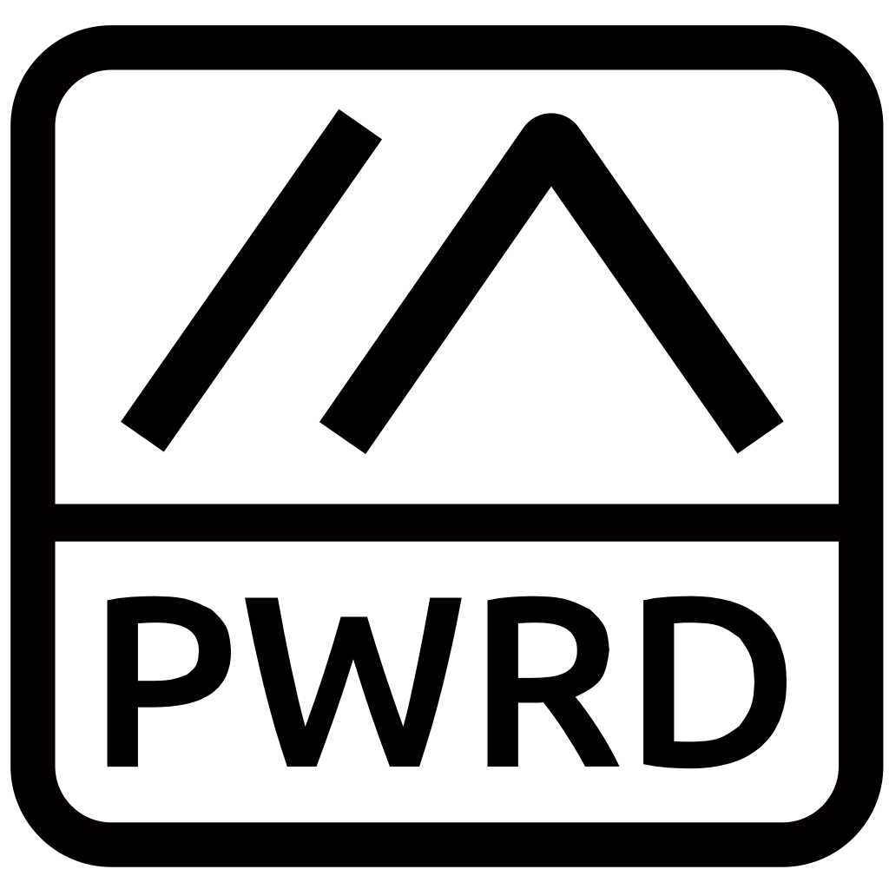

# Meshtastic Powered Logo

Indicate your project is powered by Meshtastic with this icon! There are 2 versions of this logo, one with "powered" spelled out, and one abreviated to "PWRD". It is reccomended to use the shortened "PWRD" logo for 3D printed objects for a much cleaner print. 

# Monochrome Logo

Use these for applications where monochrome files are preferred, e.g. PCB layout software, etc. There are 4 different layouts: full spelling, abbreviated, with border, and without border. Choose what works best for your application.

These work well in several formats: silk screen, solder mask removal over copper groundplane, added to the copper layer on a bare PCB, etc.

# Font Info
The font used is Ubuntu Medium, you can find the font in the link below:

https://design.ubuntu.com/font
Ubuntu Font License: https://ubuntu.com/legal/font-licence
