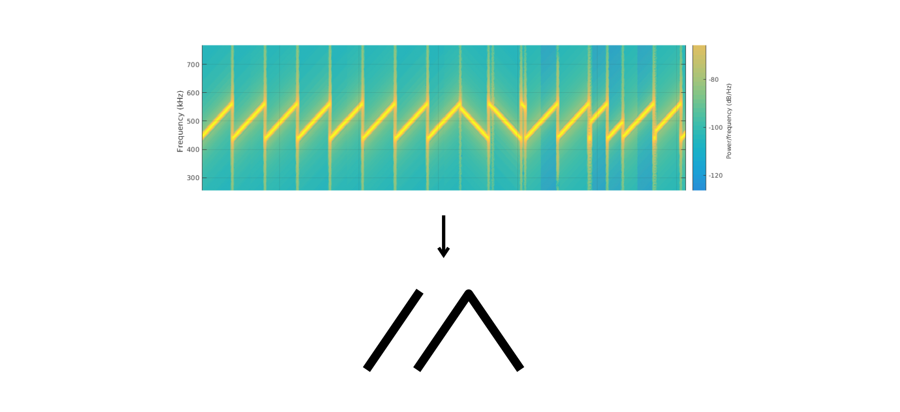
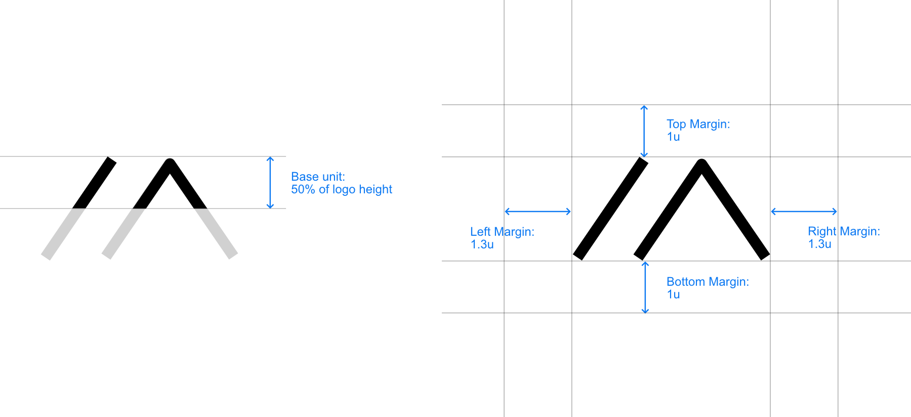
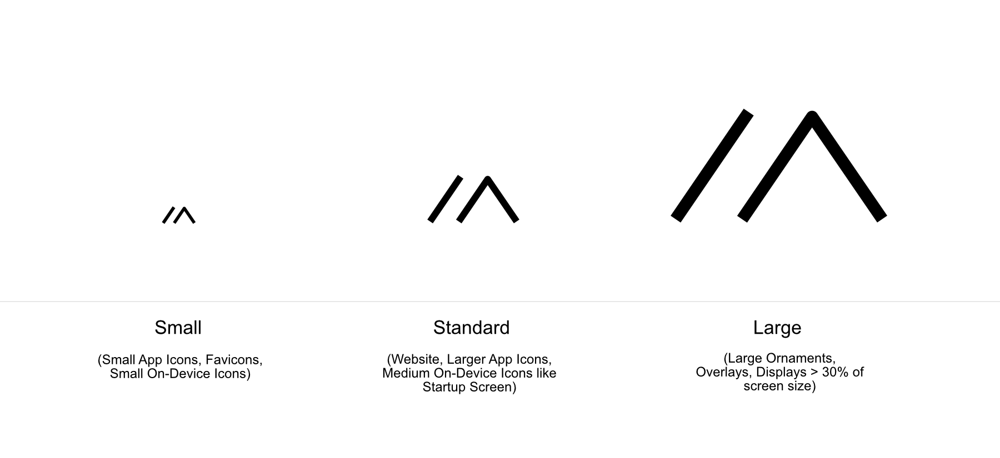
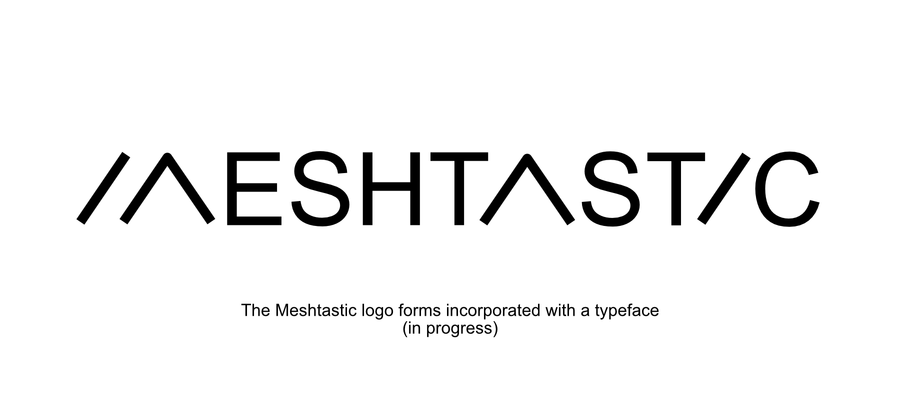
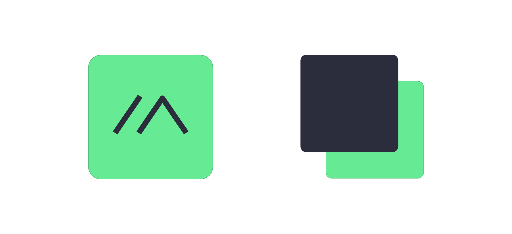

# Meshtastic Branding and Design Guidelines

[](https://cla-assistant.io/meshtastic/design)
[](https://opencollective.com/meshtastic/)
[](https://vercel.com?utm_source=meshtastic&utm_campaign=oss)

## Logo Usage

Please note that the use of the Meshtastic® logo is subject to restrictions as defined in our licensing and trademark guidelines. For more details, refer to our [Licensing and Trademark Guidelines](https://meshtastic.org/docs/legal/licensing-and-trademark/).

## Overview

The meshtastic logo is derived from the appearance/aesthetics of physical LoRa modulation.



Throughout an ongoing [community-driven design process on the meshtastic forum](https://meshtastic.discourse.group/t/design-guideline-logo/2022/41) it was refined and given additional meaning.

CycloMiles said:

> While inspired by the LoRa chirps, your logo resembles the shape of a tent [...] One could also think of mountainous areas…

This narrative also resonates with Lure.Exciting.Salads:

> I see the mountains (Where I plan on putting repeaters in my area, and where I plan on using these in general) and I also see tents (I plan on using these while backpacking, camping, snowshoeing, hunting, etc.) so it definitely speaks to me. I also clearly see the “M”
> When scaled down to under 10mm on my phone screen, I definitely feel like simple is better.

Besides the positive associations, some concerns were brought up by TitanTronics:

> I like the logo and the idea behind it, only if you notice the letter “M” seems to start out as an “i” and “a” making it look like “iaeshtastic” because you used the letter “a” and the letter “i” also in Meshtastic itself, suggesting that the two symbols used in the logo are an “i” and an “a” put together which makes “ia”

User ChomeBlue also brought up the ambiguity and non-obvious meaning:

> A non-nerd won’t relate to any of this. Not to mention; to the uninitiated, I don’t believe this would even be recognized as an "M’

Despite those concerns, most of the people involved could imagine the "LoRa-M" as the new logo. Ambiguity to a point is not detrimental if the form of the logo is able to communicate the right thing and people can identify themselves with it. Often, ambiguity makes it possible in the first place to create a distinct logo that will be associated with a brand/idea/community.

## Margins and spacing



## Sizes for different use cases



## The typeface



## Colors

Primary/Foreground color:

`#2C2D3C`

`RGB 44 45 60`

Secondary/Background/Accent color:

`#67EA94`

`RGB 103 234 148`



### Extended Color Palette

The following complementary palette is derived from the two base brand colors and provides a complete system for building accessible UIs in both light and dark modes.

#### Neutral Scale (derived from Primary `#2C2D3C`)

| Swatch | Name | Hex | RGB | Usage |
|--------|------|-----|-----|-------|
|  | Neutral 950 | `#0F1017` | `15 16 23` | Darkest background |
|  | Neutral 900 | `#1A1B26` | `26 27 38` | Dark mode background |
|  | Neutral 800 | `#2C2D3C` | `44 45 60` | **Primary** — dark mode surface / light mode text |
|  | Neutral 700 | `#3D3E50` | `61 62 80` | Dark mode elevated surface |
|  | Neutral 600 | `#555668` | `85 86 104` | Dark mode secondary text |
|  | Neutral 500 | `#6E7082` | `110 112 130` | Placeholder text |
|  | Neutral 400 | `#9496A6` | `148 150 166` | Disabled / tertiary |
|  | Neutral 300 | `#B8BAC8` | `184 186 200` | Borders (light mode) |
|  | Neutral 200 | `#D5D6E0` | `213 214 224` | Dividers |
|  | Neutral 100 | `#ECEDF3` | `236 237 243` | Light mode surface / card |
|  | Neutral 50  | `#F5F6FA` | `245 246 250` | Light mode background |

#### Green Scale (derived from Accent `#67EA94`)

| Swatch | Name | Hex | RGB | Usage |
|--------|------|-----|-----|-------|
|  | Green 100 | `#E5FCEE` | `229 252 238` | Success tint background |
|  | Green 300 | `#B5F5CE` | `181 245 206` | Light highlight |
|  | Green 400 | `#8FF0B2` | `143 240 178` | Hover / active accent |
|  | Green 500 | `#67EA94` | `103 234 148` | **Accent** — primary action / brand highlight |
|  | Green 600 | `#3FB86D` | `63 184 109` | Text on light backgrounds |
|  | Green 700 | `#2D8F52` | `45 143 82` | Strong / dark green text |

#### Semantic Colors

| Swatch | Name | Hex | RGB | Usage |
|--------|------|-----|-----|-------|
|  | Info | `#5C6BC0` | `92 107 192` | Informational indicators / links |
|  | Info Light | `#E8EAF6` | `232 234 246` | Info tint background |
|  | Warning | `#E8A33E` | `232 163 62` | Caution / attention |
|  | Warning Light | `#FFF3E0` | `255 243 224` | Warning tint background |
|  | Error | `#E05252` | `224 82 82` | Errors / destructive actions |
|  | Error Light | `#FDEAEA` | `253 234 234` | Error tint background |

> **Accessibility note:** All foreground/background pairings in this palette meet WCAG AA contrast (4.5:1 minimum). Use `Green 600` or `Green 700` for green text on light backgrounds — never the raw accent `#67EA94`, which does not meet contrast requirements on white. The `Info` blue is derived from the primary hue family for visual cohesion.

## A note to developers

If you are a developer using these images inside a Meshtastic® application, you can run bin/generate-pngs.sh to regenerate PNGs from the vector files. This script will be updated as needed to generate appropriate
'standard' sized/colored images for various platforms.

## Notes for android developers

#### App launcher icons

The icons should be generated with a separate SVG for foreground and background. The dimensions of the svg should be 108 pixels square. The middle logo should be 58 pixels wide and high.

If you need to regenerate android icons follow [this](https://developer.android.com/studio/write/image-asset-studio#create-adaptive) procedure. It will also generate the play store icons. You should name the icon ic_launcher2.

#### Action bar icons

To regenerate the action bar icons use the Image Asset tool to import logo/svg/Mesh_Logo_White.svg. Use 0% padding, HOLO_DARK theme and name the generated asset "app_icon".

## Using Design Standards with GitHub Copilot

If you are developing a Meshtastic client, you can configure GitHub Copilot to automatically enforce the [Meshtastic Client Design Standards](standards/meshtastic_design_standards_latest.md) when making UI changes.

Add the following section to your repository's `.github/copilot-instructions.md` file (create the file if it doesn't exist):

```markdown
## Design Standards

All UI must comply with the [Meshtastic Client Design Standards](https://raw.githubusercontent.com/meshtastic/design/refs/heads/master/standards/meshtastic_design_standards_latest.md). Fetch and review this document before making any UI changes.
```

This ensures that Copilot will fetch and reference the latest design standards whenever it assists with UI-related code, helping maintain cross-platform consistency for colors, typography, node identity, accessibility, and theming.

## Stats


