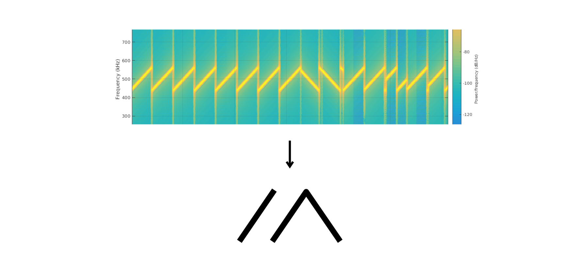
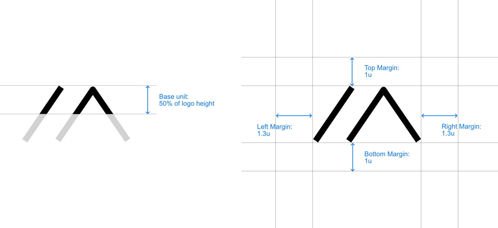
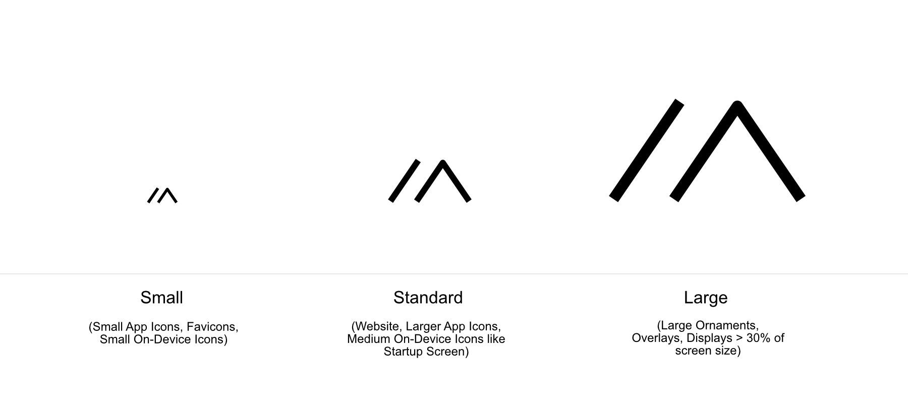
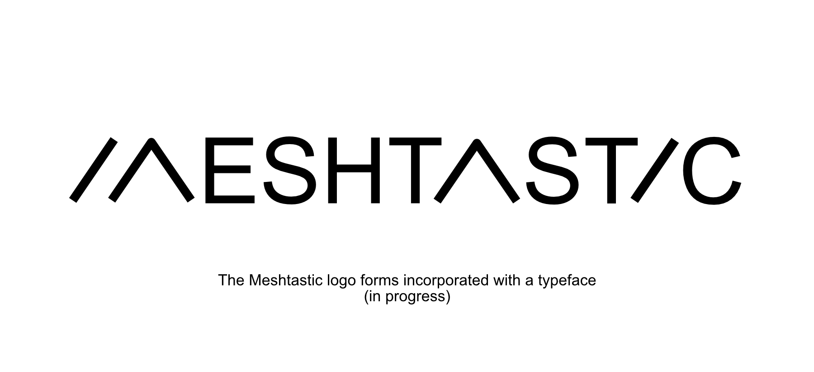
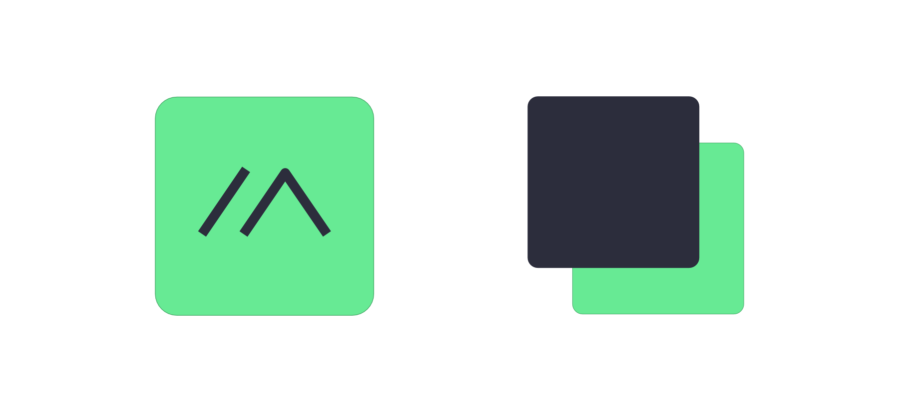

# Meshtastic Styleguide

The meshtastic logo is derived from the appearance/aesthetics of physical LoRa modulation. 

Throughout an ongoing [community-driven design process on the meshtastic forum](https://meshtastic.discourse.group/t/design-guideline-logo/2022/41) it was refined and given additional meaning.

CycloMiles said:
> While inspired by the LoRa chirps, your logo resembles the shape of a tent [...] One could also think of mountainous areas…

This narrative also resonates with Lure.Exciting.Salads:
> I see the mountains (Where I plan on putting repeaters in my area, and where I plan on using these in general) and I also see tents (I plan on using these while backpacking, camping, snowshoeing, hunting, etc.) so it definitely speaks to me. I also clearly see the “M”
> When scaled down to under 10mm on my phone screen, I definitely feel like simple is better.

Besides the positive associations, some concerns were brought up by TitanTronics:
> I like the logo and the idea behind it, only if you notice the letter “M” seems to start out as an “i” and “a” making it look like “iaeshtastic” because you used the letter “a” and the letter “i” also in Meshtastic itself, suggesting that the two symbols used in the logo are an “i” and an “a” put together which makes “ia”

User ChomeBlue also brought up the ambiguity and non-obvious meaning:
> A non-nerd won’t relate to any of this. Not to mention; to the uninitiated, I don’t believe this would even be recognized as an "M’

Despite those concerns, most of the people involved could imagine the "LoRa-M" as the new logo. Ambiguity to a point is not detrimental if the form of the logo is able to communicate the right thing and people can identify themselves with it. Often, ambiguity makes it possible in the first place to create a distinct logo that will be associated with a brand/idea/community.

## Margins and spacing

## Sizes for different use cases

## The typeface 

## Colors

Primary/Foreground color:

`#2C2D3C`

`RGB 44 45 60`

Secondary/Background/Accent color:

`#67EA94`

`RGB 103 234 148`

