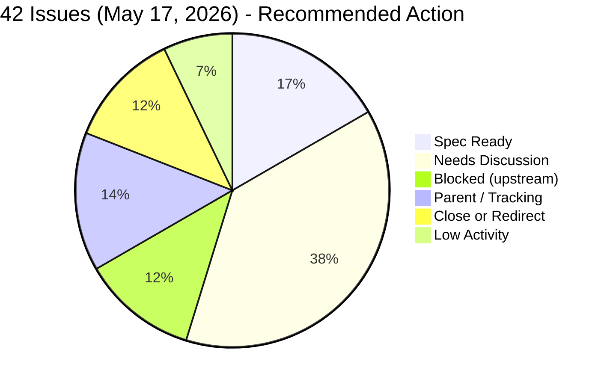
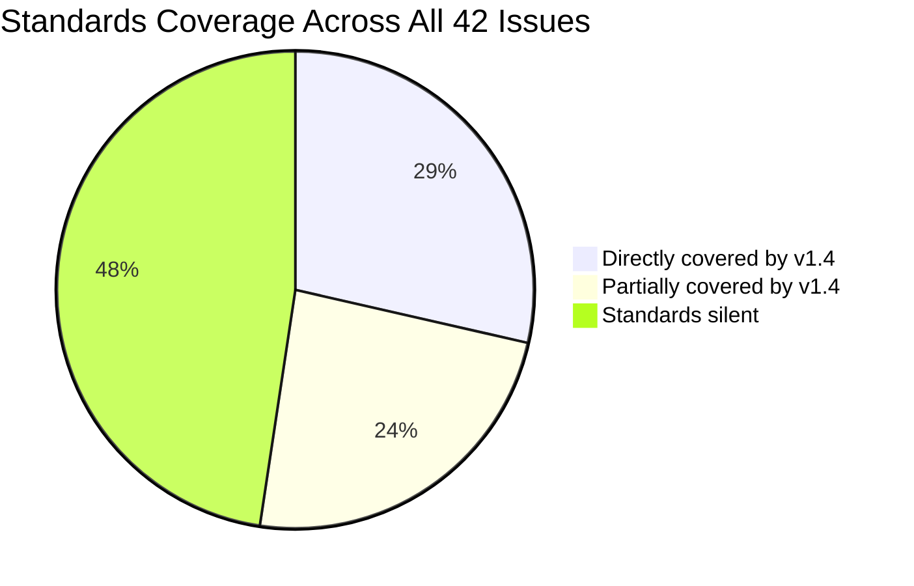
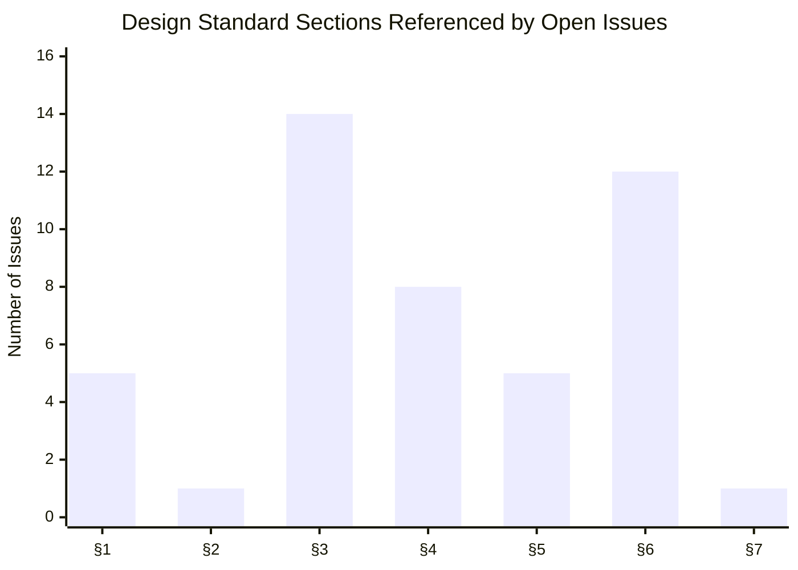
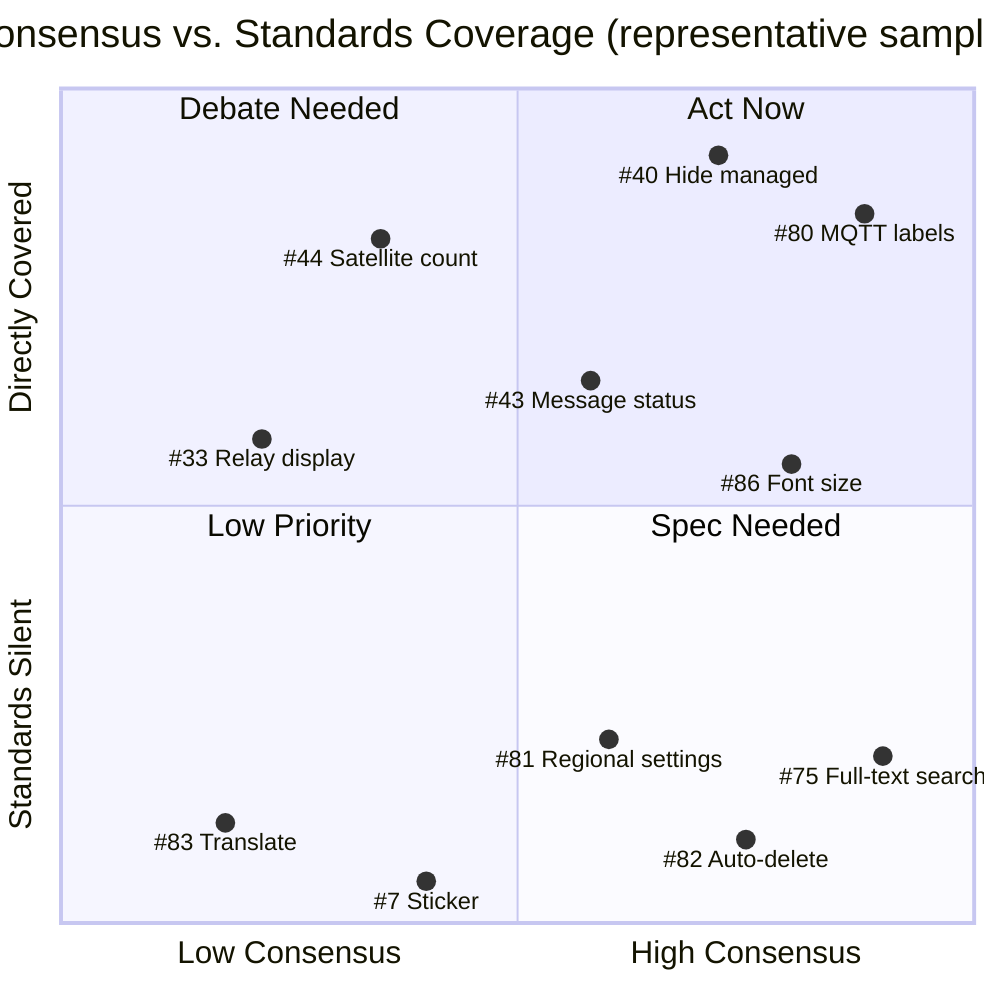

# Community Design Alignment Matrix

**Date:** May 17, 2026
**Source:** All 40 open issues in [meshtastic/design](https://github.com/meshtastic/design/issues) as of May 17, 2026
**Standards Version:** v1.4 ([meshtastic_design_standards_latest.md](../meshtastic_design_standards_latest.md))

---

## Executive Summary

This document maps every open issue in the design repository against community opinion and the Meshtastic Design Standards v1.4. For each issue, community positions are aggregated into majority and minority views, cross-referenced against the relevant standard section, and assigned an action recommendation. The goal is to surface what is ready to close, what needs a design spec, and where the community still needs to reach agreement.

**Verdict legend used throughout this document:**

| Icon | Meaning |
|------|---------|
| ✅ | Community position aligns with the design standards |
| ⚠️ | Partially aligned — some tension with the standards |
| ❌ | Position explicitly conflicts with a standard |
| 🔇 | Standards are silent; no relevant standard applies |

---

## At-a-Glance: Issue Distribution

### Action Recommendations

### Standards Coverage

### Standard Sections Referenced Across Open Issues

> §1 Node Identity · §2 Light/Dark Mode · §3 Dynamic Layout · §4 Iconography · §5 Vision-Centric · §6 Information Architecture · §7 Color Palette
>
> **§3 Dynamic Layout** and **§6 Information Architecture** are referenced by the most open issues. Alignment work in these two sections will have the highest community impact.

### Consensus vs. Standards Coverage Map

Issues plotted by *community consensus level* (x-axis) against *how directly the design standards apply* (y-axis).

- **Top-right (Act Now):** Strong consensus + standard exists → ready to spec or close
- **Top-left (Standards Exist — Debate Needed):** Standard applies but community is divided
- **Bottom-right (Spec Needed):** Community agrees but no standard yet → write a spec
- **Bottom-left (Low Priority / Redirect):** No consensus and standards silent → defer

> Representative sample only — 11 of 40 issues shown. See the full index in the Appendix for all issues with their consensus and verdict ratings.

---

## Section 1: [ALIGNMENT] Tagged Issues

These issues were explicitly filed to resolve cross-platform behavioral or display differences.

| Issue | Topic | Majority Position | Minority / Counter Position | Standard | Verdict |
|-------|-------|------------------|-----------------------------|----------|---------|
| [#54](https://github.com/meshtastic/design/issues/54) | AQI Display & Calculation | Use NowCast PM2.5; suppress AQI when data insufficient (@oscgonfer) | Rename section to "Hazards"; expand to include VOC, CO, radiation (@b8b8) | §6 IA — plain language | Majority ✅ aligned; "Hazards" label ⚠️ conflicts with §6 — alarms users when AQ is good or moderate |
| [#53](https://github.com/meshtastic/design/issues/53) _(PARENT)_ | Sensor Telemetry UI/UX | Categorize into: Power / Weather / Air Quality / Device / Soil (@oscgonfer) | N/A — taxonomy is in progress via sub-issues | §3 Dynamic Layout, §6 IA | ✅ Taxonomy aligns with §3 conditional visibility and §6 plain language |
| [#44](https://github.com/meshtastic/design/issues/44) | Satellite count display | Move to node detail/info view — expert data (@laundmo, community feedback) | Remove from all views entirely (original issue position) | §3 Dynamic Layout — suppress non-essential clutter | "Move to detail" ✅ aligned with §3; "Remove entirely" ❌ contradicts repeated community feedback |
| [#43](https://github.com/meshtastic/design/issues/43) | Message status indicators | Text-only for "Acknowledged"; better text for error states (@garthvh) | — (no counter-position, but §4 mandates icon+text redundancy) | §4 Iconography — icon+text for all status indicators | ⚠️ Text-only for acknowledged partially conflicts with §4 icon+text mandate |
| [#39](https://github.com/meshtastic/design/issues/39) | Auto-favorite nodes on DM | Implemented in Android with `manually_verified` + `CLIENT_BASE` guard (@jamesarich) | DM should not auto-favorite; risks silently favoriting uncontrolled router nodes (@aerodan) | 🔇 Standards silent on automatic node relationship behavior | ⚠️ Valid UX concern from @aerodan; no standard resolves this — needs a design decision |
| [#35](https://github.com/meshtastic/design/issues/35) | Tapback/Reaction Notifications | _(No consensus — five open questions raised by @jamesarich; no answers yet)_ | — | §4 Iconography, §6 IA (notification text) | 🔇 Partially covered — notification wording should follow §6 plain language when implemented |
| [#99](https://github.com/meshtastic/design/issues/99) | Units, Measurement & Locale | Follow OS Language & Region for all convertible units; no in-app unit controls (Apple reference implementation); wind speed = locale-driven (decided May 17) | Android had open request for in-app wind speed selector ([#87](https://github.com/meshtastic/design/issues/87), now closed) | §5 Vision-Centric (native OS patterns), §6 IA (plain language, localization) | ✅ OS locale delegation aligns with §5 native patterns and §6; 4 sub-questions still open (scaling thresholds, pressure unit, relative time format) |
| [#100](https://github.com/meshtastic/design/issues/100) | "Translate this message" cross-platform standard | Context menu entry point; on-device OS translation API; translated text persisted and toggleable (iOS reference implementation via Apple Translation framework, iOS 17.4+) | Android (#83) proposed action bar icon; community divided on engine choice (OS-level vs. ML Kit) and persistence model | §3 Dynamic Layout (hide action when unavailable), §4 Iconography (icon+text redundancy), §6 IA (plain language labels) | ⚠️ §3/§4/§6 all partially apply; 5 open alignment questions before spec | **Needs Discussion** |

### Key Takeaways — ALIGNMENT Issues

- **#54/#53:** @oscgonfer's NowCast + PM2.5 framework is the right starting point. The "Hazards" rename from @b8b8 conflicts with §6 — "Hazards" implies danger even when air quality is good. Proceed with "Air Quality" as the section label.
- **#44:** Community opposition is specifically to *removing* satellite count entirely, not to decluttering the node list. The correct resolution is: move satellite count to the node detail screen, not delete it.
- **#43:** §4 requires icon+text redundancy for status indicators. The acknowledged state should include a visual indicator alongside the text, not text alone.
- **#39:** Needs an explicit cross-platform design decision before this becomes a standard. Android implementation exists as a reference point.
- **#35:** Cannot be specced until the five open questions in the issue body are answered.
- **#99:** Wind speed is locale-driven — decided May 17, 2026; #87 closed. Four questions remain open: natural scaling thresholds, hPa confirmation as fixed pressure unit, in-app selector edge cases, and relative time vs absolute timestamp pattern for last-heard.
- **#100:** iOS has a complete reference implementation (Apple Translation framework, long-press context menu, persisted toggle between original/translated). Tracks #83 (Android feature request). Five open questions: entry point pattern, engine choice, persistence model, availability gating, and language direction control.

---

## Section 2: Feature Requests — Active Debate

Issues where commenters hold meaningfully different positions.

| Issue | Topic | Position A | Position B | Standard | Verdict | Action |
|-------|-------|-----------|-----------|----------|---------|--------|
| [#86](https://github.com/meshtastic/design/issues/86) | Adjustable font size in Conversations | Add per-app font size control or pinch-to-zoom (8 commenters) | §5 mandates OS Dynamic Type support, not a redundant in-app control (@garthvh → #21) | §5 Vision-Centric — Dynamic Type up to 200%; 16px default | ⚠️ §5 says *support* Dynamic Type, not add a redundant slider. Note: @d0ugak's contrast bug report (dark text on dark bubbles) is a §2 issue, separate from font size. | Needs Discussion |
| [#33](https://github.com/meshtastic/design/issues/33) | Relay node message display | Fix it — improve beyond hop count; add last-seen time check (@NomDeTom) | Remove it entirely — ID guessing is inherently broken and actively misleads users; specific bug with 00-suffix nodes breaks DMs (@1nv, @teran1983, @DirectX, @timurey) | §3 Dynamic Layout — suppress misleading or null data; §6 IA — plain language | "Remove" ✅ directly aligned with §3; "Fix" ⚠️ valid goal but accuracy must be proven before display | Needs Discussion |
| [#83](https://github.com/meshtastic/design/issues/83) _(tracked by [#100](https://github.com/meshtastic/design/issues/100))_ | "Translate this message" feature | Useful; use offline models (Firefox NMT, ML Kit) to avoid API costs (@GTG3000, @neopiccolorat) | Not a priority; costs, complexity, edge use-case; OS-level translate action is sufficient (@jamesarich) | §3, §4, §6 (via parent #100) | ⚠️ Partially covered — see #100 for alignment standard | Needs Discussion |
| [#79](https://github.com/meshtastic/design/issues/79) | Signal strength from incoming packets | Add table/chart to Settings → Advanced panel (reporter) | Too technically advanced for the main app; build a separate "Wireshark-type" tool (@DarkRanger935) | §4 Iconography, §5 Vision-Centric | 🔇 Standards silent on whether a feature belongs in the main app vs a separate tool | Needs Discussion |
| [#81](https://github.com/meshtastic/design/issues/81) | Auto-detect regional community settings | Hierarchical config files (country/city); geo-filter option (@Sabering1, @pedjas, @jbouse) | Don't assume one community per region; granularity varies too much across the US (@shortwavesurfer2009, @pedjas) | §6 IA — plain language for onboarding flows | 🔇 Standards silent on onboarding and community infra | Needs Discussion |
| [#9](https://github.com/meshtastic/design/issues/9) | GPS: phone GPS auto-fallback to device GPS | Auto-fallback when phone disconnects; smart position handles some cases (@garthvh) | Don't silently disable device GPS when phone GPS is lost (@b8b8) | §3 Dynamic Layout — conditional field visibility based on GPS state | ⚠️ §3 covers display logic (hide GPS fields when GPS unavailable) but fallback behavior itself is out of scope | Needs Discussion |

### Key Takeaways — Active Debates

- **#86:** §5 mandates that apps *support* Dynamic Type (i.e. don't break at 200% system font scale). A per-app font-size control is a separate UX pattern and is not required — nor prohibited — by the standard. Addressing OS Dynamic Type compliance likely resolves the root complaint. The contrast issue from @d0ugak is a §2 bug and should be addressed independently.
- **#33:** The "remove it" position is directly supported by §3 (suppress misleading data). Multiple commenters confirm real-world breakage. If accuracy cannot be guaranteed, §3 supports removal over a broken display.
- **#79:** Whether this belongs in the main app or a dedicated diagnostics tool is a product scope decision, not a design standards question. Resolve scope first.

---

## Section 3: Feature Requests — Community Consensus

Issues where the community broadly agrees and there is no significant counter-position.

| Issue | Topic | Consensus Position | Standard | Verdict | Action |
|-------|-------|-------------------|----------|---------|--------|
| [#80](https://github.com/meshtastic/design/issues/80) | Rename "Uplink/Downlink Enabled" | → "MQTT Uplink/Downlink Enabled"; @infered5 notes UDP also uses this control and suggests "Network Uplink/Downlink" | §6 IA — plain language for technical settings | ✅ Aligned; UDP nuance from @infered5 is worth investigating before spec | **Spec Ready** |
| [#85](https://github.com/meshtastic/design/issues/85) | Node list sort/filter improvements | Improve UX; @roberthadow: whatever is built must be consistent across iOS, Android, Web | §1 Circle Standard, §4 Iconography | ✅ Aligned | **Spec Ready** |
| [#84](https://github.com/meshtastic/design/issues/84) | SI prefixes for large environment values | Use intelligent SI prefixes (hPa not kPa; m/s etc.); contributor @NeimadTL assigned | §5 Vision-Centric (readability), §6 IA | ✅ Aligned | In progress |
| [#87](https://github.com/meshtastic/design/issues/87) | Configurable wind speed units | ~~Closed~~ — wind speed follows OS locale, consistent with all other speed/measurement units; no in-app selector needed | §6 IA — plain language, localization | ✅ Aligned | **Closed** — see [#99](https://github.com/meshtastic/design/issues/99) |
| [#75](https://github.com/meshtastic/design/issues/75) | Full-text search in messages | Add search similar to existing debug log search (@shalberd) | 🔇 Standards silent on search features | 🔇 Not covered | **Spec Ready** |
| [#82](https://github.com/meshtastic/design/issues/82) | Auto-delete old messages | Configurable auto-delete threshold; Android PR exists (linked by @DaneEvans) | §3 Dynamic Layout (data management) | 🔇 Standards silent on retention policy | **Spec Ready** |
| [#69](https://github.com/meshtastic/design/issues/69) | MQTT/UDP hops in traceroutes | Show "MQTT" / "UDP" labels instead of misleading 0.0 dB or ±31.75 dB values | §4 Iconography — text labels; §6 IA — remove ambiguous values | ✅ Aligned with §4 and §6 | Blocked (awaiting firmware PR #10046) |
| [#40](https://github.com/meshtastic/design/issues/40) | Hide settings when node `is_managed` | Don't display settings that cannot be changed in managed mode | §3 Dynamic Layout — hide options for disabled features | ✅ Directly and unambiguously aligned with §3 | **Spec Ready** |
| [#16](https://github.com/meshtastic/design/issues/16) | Visible info before NodeInfo arrives | Design agreed — person/question-mark icon + "Incomplete" label for nodes with `hw_model == UNSET`; iOS ✅ implemented; Android ⚠️ uses italic only — icon/label missing | §1 Circle Standard (node identity), §3 Dynamic Layout (conditional display), §4 Iconography (icon+text) | ⚠️ iOS aligns; Android gap identified May 17, 2026 | **Needs Discussion** (Android UI gap) |

---

## Section 4: Feature Requests — Standards Silent, Community Positive

Issues where the community broadly supports the feature but the design standards v1.4 do not address the topic. These need a spec written before implementation can align across platforms.

| Issue | Topic | Community Signal | Standard | Action |
|-------|-------|-----------------|----------|--------|
| [#29](https://github.com/meshtastic/design/issues/29) | Per-node channel visibility tracking | @thebentern: good for cross-platform design discussion | §3, §1 | Needs Discussion |
| [#30](https://github.com/meshtastic/design/issues/30) | Battery chemistry for INA sensor | @garthvh + @b8b8: must be cross-platform from the start | §6 IA | Needs Discussion |
| [#41](https://github.com/meshtastic/design/issues/41) | Request Telemetry action | No comments; clear need | §3, §4 | Low activity |
| [#49](https://github.com/meshtastic/design/issues/49) | LoRa vs MQTT send toggle | No comments; single request | §3 Dynamic Layout (show only when MQTT enabled) | Needs Discussion |
| [#27](https://github.com/meshtastic/design/issues/27) | Cross-platform key backup/restore flow | Security-sensitive; no comments | §5 Native patterns, §6 IA | Needs Discussion |
| [#42](https://github.com/meshtastic/design/issues/42) _(PARENT)_ | Remote add to ignore/favorite | @ianmcorvidae +1; @Bestora asks if node must be in NodeDB first | §1, §3 | Track |

---

## Section 5: Blocked on Upstream Dependencies

These issues cannot be specced or implemented until external prerequisites are met.

| Issue | Topic | Blocker | Standard | Verdict | Action |
|-------|-------|---------|----------|---------|--------|
| [#45](https://github.com/meshtastic/design/issues/45) | Allow message editing | Requires significant firmware/proto upstream effort (@jamesarich) | 🔇 Standards silent | 🔇 | Blocked |
| [#48](https://github.com/meshtastic/design/issues/48) | Per-channel MQTT topic assignment | Requires firmware proto changes (@jamesarich) | §6 IA | 🔇 | Blocked (firmware) |
| [#36](https://github.com/meshtastic/design/issues/36) _(PARENT)_ | Platform-agnostic backup & restore | Firmware transaction system too unstable (@garthvh: needs 100+ tests first) | §5 Native patterns, §6 IA | 🔇 | Blocked (firmware) |
| [#17](https://github.com/meshtastic/design/issues/17) | Custom notification sound | No licensed sound asset exists yet (@garthvh) | 🔇 Standards silent | 🔇 | Blocked (asset) |
| [#38](https://github.com/meshtastic/design/issues/38) | PKI notification for different public key | Implementation design still open; @jamesarich proposes two paths, no resolution | §4 Iconography, §6 IA | ⚠️ Presentation should follow §4/§6 when built; mechanism not in standards | Needs Discussion before Spec |

---

## Section 6: Parent / Tracking Issues

Umbrella issues that should remain open until their sub-items complete.

| Issue | Topic | Sub-item Status | Standard | Verdict | Keep Open? |
|-------|-------|----------------|----------|---------|-----------|
| [#53](https://github.com/meshtastic/design/issues/53) | Sensor Telemetry UI/UX | Sub-issues #54 (AQI) in progress; #51 (particulates) closed | §3, §6 | ✅ | Yes — active work |
| [#47](https://github.com/meshtastic/design/issues/47) | Configurable node list info | No sub-issues yet; concept aligns with §3 | §1, §3 | ✅ | Yes — needs spec |
| [#21](https://github.com/meshtastic/design/issues/21) | Cross-platform text messaging features | Active — links to #86 (font size), enhanced markup proposals | §5, §6 | ✅ @garthvh's Dynamic Type position aligned with §5 | Yes — active |
| [#20](https://github.com/meshtastic/design/issues/20) | Managed Mode Updates | Directly maps to §3; blocked on firmware | §3 Dynamic Layout | ✅ Directly aligned | Yes — blocked |
| [#15](https://github.com/meshtastic/design/issues/15) | Signal Meter | Focus on SNR (@garthvh + @ianmcorvidae agree); RSSI not in NodeDB | §4 Iconography | ✅ SNR approach aligned with §4 | Yes — engineering decision pending |

---

## Section 7: Close or Redirect

Issues that are implemented, design-resolved, or filed in the wrong repository.

| Issue | Topic | Reason | Action |
|-------|-------|--------|--------|
| [#87](https://github.com/meshtastic/design/issues/87) | Configurable wind speed units | Closed — wind speed is locale-driven per OS settings; no in-app selector needed (decision recorded in [#99](https://github.com/meshtastic/design/issues/99)) | **Closed** |
| [#51](https://github.com/meshtastic/design/issues/51) | Display raw particulate sensor data | Many PM sensors (and CO2, HCHO) now implemented per @oscgonfer | **Closed** |
| [#37](https://github.com/meshtastic/design/issues/37) | Preserve favorites on NodeDB reset | Implemented cross-platform — Android PR #3633, Apple PR [#1828](https://github.com/meshtastic/Meshtastic-Apple/pull/1828); firmware issue #8226 merged | **Closed** |
| [#46](https://github.com/meshtastic/design/issues/46) | Bug: Service notification stats missing | Bug report filed in wrong repo — redirected to [Meshtastic-Android](https://github.com/meshtastic/Meshtastic-Android) on May 17, 2026 | **Redirected** to Android |
| [#7](https://github.com/meshtastic/design/issues/7) | Hexagon sticker | Branding/assets request, not a client UI design issue | **Redirect** to meshtastic/meshtastic or design team |

---

## Appendix: Full Issue Index

All 42 issues tracked (40 original + #99, #100 added May 17, 2026; #37, #51, #87 closed).

| # | Title (abbreviated) | Labels | Consensus | Standard | Verdict | Action |
|---|---------------------|--------|-----------|----------|---------|--------|
| [#100](https://github.com/meshtastic/design/issues/100) | "Translate this message" cross-platform standard | [ALIGNMENT] | Divided (iOS impl exists; 5 open questions) | §3, §4, §6 | ⚠️ | Needs Discussion |
| [#99](https://github.com/meshtastic/design/issues/99) | Units, Measurement & Locale | [ALIGNMENT] | Partial (wind speed resolved) | §5, §6 | ✅ | Needs Discussion |
| [#87](https://github.com/meshtastic/design/issues/87) | Configurable wind speed units | enhancement | Resolved | §6 | ✅ | Closed |
| [#86](https://github.com/meshtastic/design/issues/86) | Adjustable font size in Conversations | enhancement | Strong (but conflicts with §5) | §5 | ⚠️ | Needs Discussion |
| [#85](https://github.com/meshtastic/design/issues/85) | Node list sort/filter improvements | enhancement | Strong | §1, §4 | ✅ | Spec Ready |
| [#84](https://github.com/meshtastic/design/issues/84) | SI prefixes for env metrics | enhancement | Strong | §5, §6 | ✅ | In Progress |
| [#83](https://github.com/meshtastic/design/issues/83) | "Translate this message" | enhancement | Divided | §3, §4, §6 | ⚠️ | Needs Discussion (see #100) |
| [#82](https://github.com/meshtastic/design/issues/82) | Auto-delete old messages | enhancement | Strong | §3 | 🔇 | Spec Ready |
| [#81](https://github.com/meshtastic/design/issues/81) | Auto-detect regional community settings | enhancement | Moderate, divided on granularity | §6 | 🔇 | Needs Discussion |
| [#80](https://github.com/meshtastic/design/issues/80) | Rename "Uplink/Downlink Enabled" | enhancement | Strong | §6 | ✅ | Spec Ready |
| [#79](https://github.com/meshtastic/design/issues/79) | Signal strength from incoming packets | enhancement | Divided | §4, §5 | 🔇 | Needs Discussion |
| [#75](https://github.com/meshtastic/design/issues/75) | Full-text search in messages | enhancement | Strong | 🔇 | 🔇 | Spec Ready |
| [#69](https://github.com/meshtastic/design/issues/69) | MQTT/UDP hops in traceroutes | enhancement | Strong | §4, §6 | ✅ | Blocked (firmware PR #10046) |
| [#54](https://github.com/meshtastic/design/issues/54) | AQI display & calculation | [ALIGNMENT] | Strong on algorithm; divided on naming | §6 | ⚠️ | Needs Discussion (naming) |
| [#53](https://github.com/meshtastic/design/issues/53) | Sensor telemetry UI/UX | [PARENT][ALIGNMENT] | — | §3, §6 | ✅ | Track |
| [#51](https://github.com/meshtastic/design/issues/51) | Raw particulate sensor data | enhancement | Strong | §3 | ✅ | Closed |
| [#49](https://github.com/meshtastic/design/issues/49) | LoRa vs MQTT send toggle | [FEAT] | None | §3 | 🔇 | Needs Discussion |
| [#48](https://github.com/meshtastic/design/issues/48) | Per-channel MQTT topic | enhancement | None | §6 | 🔇 | Blocked (firmware) |
| [#47](https://github.com/meshtastic/design/issues/47) | Configurable node list info | [PARENT] | — | §1, §3 | ✅ | Track |
| [#46](https://github.com/meshtastic/design/issues/46) | Bug: service notification stats | bug | — | §4 | 🔇 | Redirected to Android |
| [#45](https://github.com/meshtastic/design/issues/45) | Allow message editing | enhancement | Blocked | 🔇 | 🔇 | Blocked (upstream) |
| [#44](https://github.com/meshtastic/design/issues/44) | Satellite count display | [ALIGNMENT] | Move to detail view (not remove) | §3 | ✅ | Needs Discussion |
| [#43](https://github.com/meshtastic/design/issues/43) | Message status indicators | [ALIGNMENT] | Text-only for acknowledged | §4 | ⚠️ | Needs Discussion |
| [#42](https://github.com/meshtastic/design/issues/42) | Remote add to ignore/favorite | [PARENT] | Positive | §1, §3 | 🔇 | Track |
| [#41](https://github.com/meshtastic/design/issues/41) | Request Telemetry action | [FEAT] | None | §3, §4 | 🔇 | Low activity |
| [#40](https://github.com/meshtastic/design/issues/40) | Hide settings when `is_managed` | [FEAT] | Strong | §3 | ✅ | Spec Ready |
| [#39](https://github.com/meshtastic/design/issues/39) | Auto-favorite on DM | [ALIGNMENT] | Implemented in Android; concern raised | 🔇 | ⚠️ | Needs Discussion |
| [#38](https://github.com/meshtastic/design/issues/38) | PKI notification for different key | [FEAT] | Design open | §4, §6 | ⚠️ | Needs Discussion |
| [#37](https://github.com/meshtastic/design/issues/37) | Preserve favorites on reset | [FEAT] | Implemented (cross-platform) | §1 | ✅ | Closed |
| [#36](https://github.com/meshtastic/design/issues/36) | Backup/restore file format | [PARENT] | Blocked | §5, §6 | 🔇 | Blocked (firmware) |
| [#35](https://github.com/meshtastic/design/issues/35) | Tapback/reaction notifications | [ALIGNMENT] | None yet | §4, §6 | 🔇 | Needs Discussion |
| [#33](https://github.com/meshtastic/design/issues/33) | Relay node message display | — | Divided | §3, §6 | ⚠️ | Needs Discussion |
| [#30](https://github.com/meshtastic/design/issues/30) | Battery chemistry for INA sensor | enhancement | Positive | §6 | 🔇 | Needs Discussion |
| [#29](https://github.com/meshtastic/design/issues/29) | Per-node channel tracking | enhancement | None | §3 | 🔇 | Low activity |
| [#27](https://github.com/meshtastic/design/issues/27) | Cross-platform key backup flow | — | — | §5, §6 | ⚠️ | Needs Discussion |
| [#21](https://github.com/meshtastic/design/issues/21) | Cross-platform text messaging | [PARENT] | Active | §5, §6 | ✅ | Track |
| [#20](https://github.com/meshtastic/design/issues/20) | Managed Mode updates | [PARENT] | — | §3 | ✅ | Track |
| [#17](https://github.com/meshtastic/design/issues/17) | Custom notification sound | enhancement | Blocked | 🔇 | 🔇 | Blocked (asset) |
| [#16](https://github.com/meshtastic/design/issues/16) | Visible info before NodeInfo arrives | — | Agreed | §1, §3 | ✅ | Needs Discussion (Android gap) |
| [#15](https://github.com/meshtastic/design/issues/15) | Signal Meter | [PARENT] | SNR focus agreed | §4 | ✅ | Track |
| [#9](https://github.com/meshtastic/design/issues/9) | Conditional GPS validation | — | Divided | §3 | ⚠️ | Needs Discussion |
| [#7](https://github.com/meshtastic/design/issues/7) | Hexagon sticker | — | Positive | §7 | 🔇 | Redirect |
